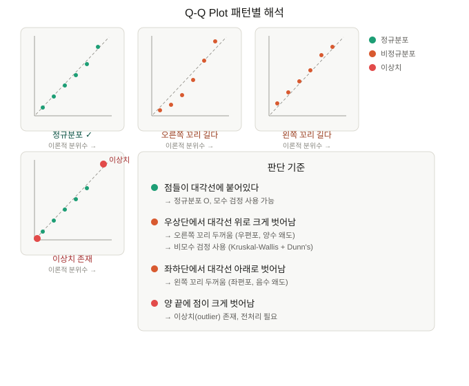

이번 프로젝트 주제는 다이캐스팅 공정에서 발생하는 불량을 예측하는 머신러닝 모델을 개발하는 것이었다.
프로젝트를 진행하면서 데이터 분석과 모델 학습의 전체적인 진행 흐름을 정리하고 각 단계별 개념을 확실히 다지고 싶었다.
특히 같은 주제로 프로젝트를 진행하였지만 수준 높은 결과물을 낸 다른 팀의 사례와 비교 해보면서 반성하고 인사이트를 얻고자 한다.

## EDA
### 1. 모든 변수에 대한 정규성 확인
- 선형 또는 비선형 데이터인지 확인

### 2. 정규성 검정
```text
💡이번 심화프로젝트에 적용 해보지 않은 검정이다.
데이터가 정규성을 가지는지 여부를 확인 해보면 좋았을 것 같다.
```
#### Shapiro-wilk Test
데이터 수가 많으면 민감도가 높다.
데이터가 수천 개 이상이면 실제로는 거의 정규 분포에 가까워도 아주 미세한 차이를 잡아서 p < 0.05가 나올 때가 많다.
- n < 50: 신뢰도 높음
- n > 100: 결과 맹신❌ → Q-Q Plot 도 같이 확인해야 함
>"점의 절반 이상이 대각선에서 눈에 띄게 벗어난다" 싶으면 정규분포 아닌 것으로 판단


```text
데이터 있음
    ↓
Shapiro-Wilk 검정
    ↓
p > 0.05?
   ├─ YES → 정규분포 O → t검정, ANOVA 등 사용 가능
   └─ NO  → 정규분포 X → 비모수 검정 사용 (Mann-Whitney, Kruskal-Wallis 등)
```
### 3. 가설검정
#### Kruskal-Wallis Test
- 비모수 검정
- 여러 그룹 간의 평균 차이를 검정 (3개 이상..)
```text
💡다이캐스팅 공정 프로젝트 맥락에서 센서 데이터(온도, 압력 등)가 정규분포인지 확인할 때 사용할 수 있다.
제조 공정 데이터는 보통 정규분포를 따르지 않는 경우가 많아서, Shapiro-Wilk로 확인 후, 비모수 검정(Kruskal-Wallis)을 사용해 여러 그룹 간의 평균 차이를 검정할 수 있다.

참고로, 진행한 심화프로젝트에서는 Mann-Whitney U Test를 사용했음.
Kruskal-Wallis Test 로 여러 그룹 간의 차이가 있는지도 확인 해보면 좋았을 것 같다.
(정상 / 표면불량 / 구조불량)
```
#### Mann-Whitney U Test
- 비모수 검정
- 2개 그룹 간의 평균 차이를 검정
- 앞서 Kruskal-Wallis 가 3개 이상의 그룹 간의 평균 차이를 검정했다면, Mann-Whitney U Test는 2개 그룹 간의 평균 차이를 검정한다.
```text
예)
정상 / 표면불량 / 구조불량
        ↓
처음부터 Kruskal-Wallis 로 세 그룹 비교
        ↓
유의미한 변수만 → Dunn's Test 로 어느 쌍이 다른지 확인
```
### 4. 사후검정
➡ 3개 이상의 집단을 비교했을 때, p-value나 효과크기만으로는 "차이가 있다"만 알 수 있을 뿐, 실질적으로 어느 쌍에서 차이가 발생하는 지 알 수 없기 때문에 사후검정이 필요하다.
```
⚠️ 2개의 집단을 비교한다면 사후 검정 및 분석이 필요 없고 효과크기로 충분하다.
```
#### Dunn's Test
➡ 3개 이상의 그룹에서, 어떤 두 그룹 쌍이 서로 다른지 하나씩 찾아내는 검정
- 다중비교 보정 적용. (쌍을 많이 비교할 수록 우연이라고 나올 수 있는 것을 보정)
> 어느 그룹끼리 다른가? ➡ 어떤 그룹 쌍이 다른지 구체적으로 파악
```text
반에서 키를 쟀다고 하자. 3개의 분단이 있을 때:

Kruskal-Wallis: "3개 분단 중 키가 다른 분단이 있나요?"
                → "네, 있어요" (어딘지는 모름)

Dunn's Test:    "그럼 어느 분단끼리 다른가요?"
                → 1분단 vs 2분단: 다름
                → 1분단 vs 3분단: 비슷함
                → 2분단 vs 3분단: 다름
```
무엇을 기준으로 다르다고 판단할까?  
➡ 각 쌍마다 p-value를 계산
```text
p < 0.05  →  두 그룹이 통계적으로 다르다
p ≥ 0.05  →  두 그룹이 통계적으로 비슷하다
```
#### ANOVA와 비교

| 항목 | ANOVA + Tukey | Kruskal-Wallis + Dunn's |
|------|--------------|------------------------|
| 가정 | 정규분포 필요 | 정규분포 불필요 |
| 데이터 | 연속형, 균등 분산 | 순위 기반, 비모수 |
| 사후 검정 | Tukey HSD | Dunn's Test |

```text
💡다이캐스팅 프로젝트에 적용한다면?
예를들어 불량 유형별(정상/표면불량/구조불량)로 특정 센서값이 차이가 나는지 볼 때:
1. Kruskal-Wallis 로 세 그룹 중 "유의미한 차이가 있다" 확인
2. Dunn's Test 로 표면 불량 vs 구조 불량
    - "이 두 불량 유형이 공정 변수에서 서로 다른가?"
    - "어떤 변수가 두 불량 유형을 구분하는 데 핵심인가?"
```
### 5. 상관계수
➡ 두 변수 사이에 관계가 있는지, 얼마나 강한지를 수치로 나타냄

```markdown
**공통점**
- 결과값 범위: -1 ~ +1
- +1에 가까울수록 강한 양의 상관, -1에 가까울수록 강한 음의 상관, 0이면 무관계
- 둘 다 두 변수 사이의 관계를 측정
```
#### 피어슨 상관계수
➡ 실제 값으로 계산. "온도가 1도 오를 때 압력이 얼마나 오르나"처럼 값 자체의 선형 관계를 본다.
- 두 변수 간의 선형 관계를 측정
- -1 ~ 1 사이의 값을 가지며, 1에 가까울수록 강한 양의 선형 관계, -1에 가까울수록 강한 음의 선형 관계, 0에 가까울수록 선형 관계가 약함

#### 스피어만 상관계수
➡ 순위로 계산. 값이 크고 작은 순서만 본다. 온도값 [10, 50, 200] 을 [1위, 2위, 3위] 로 변환한 다음 피어슨을 적용.
- 두 변수 간의 단조 관계를 측정
- -1 ~ 1 사이의 값을 가지며, 1에 가까울수록 강한 양의 단조 관계, -1에 가까울수록 강한 음의 단조 관계, 0에 가까울수록 단조 관계가 약함
```text
💡단조관계란?
- 단조 증가: X가 커지면 Y도 항상 커짐 (꼭 직선일 필요 없음)
- 단조 감소: X가 커지면 Y도 항상 작아짐
- 비단조: X가 커질 때 Y가 올라갔다 내려갔다 함 → 둘 다 못 잡음
```
**언제 뭘 서야할까?**
| 상황 | 선택 |
|------|------|
| 두 변수 모두 정규분포 + 선형 관계 | 피어슨 |
| 하나라도 비정규분포 | 스피어만 |
| 이상치가 많다 | 스피어만 |
| 관계가 비선형이지만 단조 | 스피어만 |
| 잘 모르겠다 | 스피어만 (더 보수적이고 안전) |

```text
다이캐스팅 프로젝트에서 센서 데이터는 비정규분포 였고, 이상치도 있었기 때문에 스피어만을 사용했다.
```
**상관관계 검정 단계**
1. 두 변수 사이에 관계가 있을 것 같다는 가설이 있고,
    1. 산점도로 먼저 본다. (변수가 많으면 Pair Plot으로 한번에 볼 수 있다.)
    2. 뭔가 패턴이 있는데?
    3. 상관계수 확인.
2. 도메인 지식으로 관계가 있을 법한 쌍을 추린다.
    - 예) 다이캐스팅 맥락에서 "'사출압력'과 '사출속도'는 관계가 있을 것 같다."
3. 히트맵으로 전체 상관 구조 확인.
    - 색 진한 쌍에 대해서 상관계수 + p-value 확인
4. 유의미하면 추가분석 → 회귀분석, 인과관계 탐색 등

## 머신러닝
심화 프로젝트에서 학습 모델 선택을 위한 실험 단계가 없었던 점이 아쉬웠다.
다른 팀이 모델 선택을 위한 실험 과정을 보여줬는데, 다음 프로젝트에 적용 해 보면 좋을 것 같아 내용을 정리 해 보았다.

### 1차 모델 선택
#### SMOTE 적용 실험
우리 팀의 경우, SMOTE 를 적용하지 않았다.
SMOTE 는 데이터의 균형을 맞추기 위해 소수 클래스 데이터를 인공적으로 만들어 낸다. 그런데 그렇게 되면 기존에 존재하지 않는 공정 방법에 의한 불량 데이터가 생성될 수 있는 오류가 발생할 수 있기 때문이라고 판단했다.  

이러한 판단도 틀리지 않았지만, 실험을 통해 증명했다면 더 좋았을 것 같다.
다른 팀은 SMOTE 적용하여 후보 모델들의 성능을 비교하는 실험을 진행했는 점이 인상깊었다.
SMOTE sampling strategy 를 0부터 0.5까지 증가시키면서 원하는 `Recall` 기준을 설정하고, `Precision` 과 `f1-score` 를 비교하여 최적의 모델과 전략을 찾았다.

### 2차 모델 선택
앞서 선택한 1차 모델 후보들을 가지고 OOF 임계값 탐색을 진행하며 최적의 임계값을 찾아 2차 모델을 선택한다.

#### OOF(Out Of Fold) 임계값 탐색
**임계값이란?**  
다이캐스팅 공정에서는 정상을 불량이라고 판단하는 것이 더 큰 손실을 야기하기 때문에, 최대한 불량을 많이 잡는 것이 중요하다.  
따라서 클래스 불균형 + 놓치면 안되는 케이스가 있을 때는 0.5가 최적이 아닐 수 있다.  
이럴 때 OOF 임계값을 조정하여 원하는 `Recall` 기준을 만족하면서 `Precision` 과 `f1-score` 를 비교하여 최적의 전략을 찾는다.



| 임계값 낮추면 | 임계값 높이면 |
|--------------|--------------|
| 불량 더 많이 잡음 (Recall ↑) | 불량 더 적게 잡음 (Recall ↓) |
| 정상을 불량으로 오탐 늘어남 (Precision ↓) | 정상을 정상으로 잘 맞춤 (Precision ↑) |

앞서 SMOTE 전략 적용 결과로 선택한 모델을 가지고 OOF 임계값을 탐색한다. OOF로 탐색한 임계값이 최종 임계값이 된다.
```text
💡OOF 임계값이란?
모델은 예측할 때 0~1 사이의 확률값을 뱉는다. 이걸 최종 클래스(불량/정상)로 바꾸려면 기준선(임계값, threshold)이 필요하다.
기본값은 0.5인데, OOF 예측값을 이용해서 가장 적절한 임계값을 찾는 것이 OOF 임계값이다.

예)
모델 출력: 0.32, 0.71, 0.45, 0.88, 0.39 ...
                    ↓ 임계값 0.5 적용
최종 판정:  정상,  불량,  정상,  불량,  정상
```

모델은 예측할 때 클래스를 바로 내뱉는 게 아니라 확률값을 먼저 뱉는다.

```text
샘플 1: 불량일 확률 = 0.82  → 불량
샘플 2: 불량일 확률 = 0.45  → ?
샘플 3: 불량일 확률 = 0.31  → 정상
```

샘플 2처럼 애매한 경우, "몇 이상이면 불량으로 볼 거냐"를 정하는 기준선이 임계값(Threshold)이다.

반면에 OOF Threshold는 OOF 예측값을 이용해서 계산한 최적 임계값이다.
시험 채점을 예로 들면,
- OOF = 모의고사 (실전 시험에 안 쓴 문제로 연습)
- 임계값 = 몇 점 이상이면 합격으로 볼 것인가

❓**그럼 왜 OOF Threshold를 사용해야 할까?**  
Threshold 를 찾으려면 "기준이 될 예측값"이 필요하다.
Threshold 를 조정하려면 어떤 데이터의 예측값을 보고 판단해야한다. 
```text
① 학습 데이터로 임계값 찾기   → 과적합 (모델이 이미 본 데이터라 점수가 뻥튀기)
② 테스트 데이터로 임계값 찾기 → 반칙   (테스트셋은 최종 평가용으로 딱 한 번만 써야 함)
③ OOF 예측값으로 임계값 찾기  → 올바름 (모델이 못 본 데이터니까 신뢰할 수 있음)
```
Threshold 조정은 필요한데, 그 기준을 어떤 데이터로 잡느냐가 문제다. OOF는 그 기준을 신뢰할 수 있게 잡기 위한 장치다.
OOF를 위해 별도의 데이터를 떼어 놓는 게 아니라, 학습 데이터 안에서 교차검증을 돌리면서 자연스럽게 만들어지는 것이다.
```text
전체 데이터
    ├─ 테스트셋 (20%) ← 처음부터 떼어놓고 절대 안 건드림
    │
    └─ 학습 데이터 (80%)
            ├─ Fold 1 검증 → OOF 예측값 생성
            ├─ Fold 2 검증 → OOF 예측값 생성
            ├─ Fold 3 검증 → OOF 예측값 생성
            ├─ Fold 4 검증 → OOF 예측값 생성
            └─ Fold 5 검증 → OOF 예측값 생성
                                    ↓
                          OOF 예측값으로 최적 임계값 탐색
                                    ↓
                          찾은 임계값을 테스트셋에 적용
```
> OOF는 별도로 데이터를 떼는 게 아니라, 학습 데이터 안에서 교차검증이 돌아가면서 자동으로 만들어지는 "모델이 못 본 예측값"이다.

**OOF Threshold 코드 예시**
```python
from sklearn.model_selection import train_test_split, StratifiedKFold
import numpy as np

# 1단계: 테스트셋 먼저 분리 (이후 절대 안 건드림)
X_train, X_test, y_train, y_test = train_test_split(
    X, y, test_size=0.2, stratify=y, random_state=42
)

# 2단계: 학습 데이터 안에서 교차검증으로 OOF 생성
kf = StratifiedKFold(n_splits=5, shuffle=True, random_state=42)
oof_probs = np.zeros(len(X_train))  # 학습 데이터 전체 크기

for train_idx, val_idx in kf.split(X_train, y_train):
    X_tr, X_val = X_train[train_idx], X_train[val_idx]
    y_tr, y_val = y_train[train_idx], y_train[val_idx]

    model.fit(X_tr, y_tr)
    oof_probs[val_idx] = model.predict_proba(X_val)[:, 1]
    #                     ↑ 이게 OOF 예측값 (모델이 못 본 데이터)

# 3단계: OOF로 최적 임계값 탐색
best_threshold = 0.5
best_recall = 0
for threshold in np.arange(0.1, 0.9, 0.01):
    preds = (oof_probs >= threshold).astype(int)
    recall = recall_score(y_train, preds)
    if recall > best_recall:
        best_recall = recall
        best_threshold = threshold

# 4단계: 찾은 임계값으로 테스트셋 최종 평가
final_model.fit(X_train, y_train)
test_probs = final_model.predict_proba(X_test)[:, 1]
final_preds = (test_probs >= best_threshold).astype(int)
```
**주요 코드 설명**
```python
for fold, (train_idx, val_idx) in enumerate(kf.split(X_train, y_train)):
    X_tr, X_val = X_train[train_idx], X_train[val_idx]
    y_tr, y_val = y_train[train_idx], y_train[val_idx]
    
    model.fit(X_tr, y_tr)
    oof_probs[val_idx] = model.predict_proba(X_val)[:, 1]
```

`kf.split()`이 매 반복마다 학습에 쓸 인덱스와 검증에 쓸 인덱스를 나눈다.
매 Fold마다 파란 구간(val_idx)이 한 칸씩 이동하고 전체 학습 데이터가 반드시 한 번씩 val_idx가 된다.
```python
X_tr, X_val = X_train[train_idx], X_train[val_idx]
```
```python
# 예시: X_train 이 10개짜리 데이터라면
X_train = [A, B, C, D, E, F, G, H, I, J]

# Fold 1에서 kf.split() 이 이런 인덱스를 줬다면
train_idx = [2, 3, 4, 5, 6, 7, 8, 9]
val_idx   = [0, 1]

# 이렇게 잘림
X_tr  = [C, D, E, F, G, H, I, J]  # 학습용
X_val = [A, B]                     # 검증용 (OOF)
```
인덱스로 실제 데이터를 잘라낸다.
```python
model.fit(X_tr, y_tr)
```
검증 데이터(X_val)를 전혀 보지 않은 상태로 학습한다. X_val은 모델 입장에서 처음 보는 데이터다.

**전체 흐름 정리**
```text
반복 시작
  ├─ kf.split()       → train_idx, val_idx 생성
  ├─ X_train[인덱스]  → 실제 데이터로 분리
  ├─ model.fit(X_tr)  → val 데이터는 절대 안 보고 학습
  ├─ predict_proba()  → val 데이터 예측 (처음 보는 데이터)
  └─ oof_probs 채움   → 해당 인덱스 위치에 확률값 저장
반복 종료

→ oof_probs 완성: 전체 학습 데이터에 대한 신뢰할 수 있는 예측값
→ 이걸로 최적 임계값 탐색
```

### 모델 최종 선택
2차 선택 모델로 IF(Isolation Forest)를 진행한다.
```text
💡IF(Isolation Forest)란?
데이터에서 이상치(outlier)를 탐지하는 알고리즘. 각 샘플마다 "얼마나 이상한가"를 수치로 나타낸 것이 IF점수
```
"고립(Isolate)시키기 얼마나 쉬운가"로 이상치를 판단한다.
- 이상치는 다른 데이터와 멀리 떨어져 있어서 금방 고립됨
- 정상치는 데이터가 밀집한 곳에 있어서 고립시키기 어려움

랜덤하게 특성을 골라 값을 기준으로 데이터를 계속 쪼개는데, 몇 번 만에 혼자 남겨지는지를 기록하여 횟수(경로 길이)를 점수로 변환한 것이 IF점수.

**IF 점수 범위**
```text
점수 범위: -1 ~ 1  (사이킷런 기준)

 1에 가까울수록  →  이상치 (고립이 쉬웠다)
 0에 가까울수록  →  경계선
-1에 가까울수록  →  정상치 (고립이 어려웠다)
```
```text
💡다이캐스팅 공정 맥락에서
센서 데이터에서 공정 이상 상황을 사전에 걸러낼 때 유용하다. 불량 예측 모델 학습 전에 IF로 극단적인 이상치를 제거하면 모델 성능이 향상될 수 있다.
```
2차 선택한 모델에 IF 점수를 주어 Recall 값과 Precision, f1-score 값을 확인하여 최적의 모델을 최종적으로 선택한다.

### 모델 학습 결과 시각화
#### 혼동행렬 (Confusion Matrix)

다이캐스팅 공정 프로젝트에서는 FN 숫자를 최소화 하는 것이 목표.

#### ROC-AUC
**ROC 곡선**
➡ 임계값을 0부터 1까지 쭉 바꿔가면서 그때마다의 TPR(Recall)과 FPR을 점으로 찍어 이은 곡선.
```text
TPR (True Positive Rate)  =  Recall  =  실제 불량 중 맞춘 비율
FPR (False Positive Rate)           =  실제 정상 중 잘못 불량으로 판정한 비율
```
**AUC(Area Under Curve)**

➡ ROC 곡선 아래의 면적.  

**💡Recall 과의 차이**
| 항목 | Recall | ROC-AUC |
|------|--------|---------|
| 측정 대상 | 특정 임계값에서의 성능 | 모든 임계값에서의 종합 성능 |
| 값 범위 | 0 ~ 1 | 0.5 ~ 1 |
| 특징 | 임계값 바뀌면 값도 바뀜 | 임계값과 무관한 고정된 값 |
| 의미 | "지금 이 기준으로 얼마나 잡나" | "이 모델이 전반적으로 얼마나 좋나" |

> 임계값을 어떻게 잡든 상관없이, 이 모델이 전반적으로 정상과 불량을 얼마나 잘 구분하는지를 나타내는 종합 점수

#### SHAP(SHapley Additive exPlanations)

➡ 모델이 특정 샘플에 대해 예측한 결과를 "각 변수가 얼마나 기여했는가"로 분해해서 설명해주는 기법
XGBoost, LighGBM 같은 모델은 성능은 좋지만 블랙박스다. 예측 결과는 나오는데 왜 그렇게 예측했는지 알 수 없다.
이것을 설명해주는 게 SHAP이다.

>"이 변수가 없었다면 예측값이 얼마나 달라졌을까"를 모든 변수 조합에 대해 계산해서 평균낸 기여도
```text
① Feature Importance (전체 관점): 모든 샘플의 SHAP 절댓값 평균 → "어떤 변수가 전반적으로 중요한가"
② Waterfall Plot (개별 샘플 관점): 특정 샘플 하나가 왜 불량으로 예측됐는지 변수별로 분해
③ Dependence Plot (변수-기여도 관점): X축 변수값, Y축 SHAP값 → "어느 구간에서 불량에 기여하나"
④ Summary Plot (전체 + 방향): 변수 중요도 + 값이 높을 때/낮을 때 어느 방향으로 기여하는지 한번에
```
> 모델이 왜 이렇게 예측했는지, 각 변수가 얼마나 어느 방향으로 기여했는지 수치로 설명해준다.

## 프로젝트를 마치며
이렇게 프로젝트를 진행했던 경험과 다른 팀의 프로젝트 경험을 바탕으로 다시 한번 전체적인 흐름과 적절한 검정 활용법, 머신러닝 모델 학습 실험을 살펴봤다.
프로젝트를 진행하면서 그리고 마치고서야 통계와 머신러닝에 대해 이해도를 좀 더 높일 수 있었다.
결국 데이터 분석은 실험과 검정을 통해 가설을 세우고 검증하는 과정의 반복이다.
이번 회고를 바탕으로 다음 프로젝트에서는 좀 더 체계적으로 접근하여 더 나은 결과물을 낼 수 있도록 노력해야겠다.