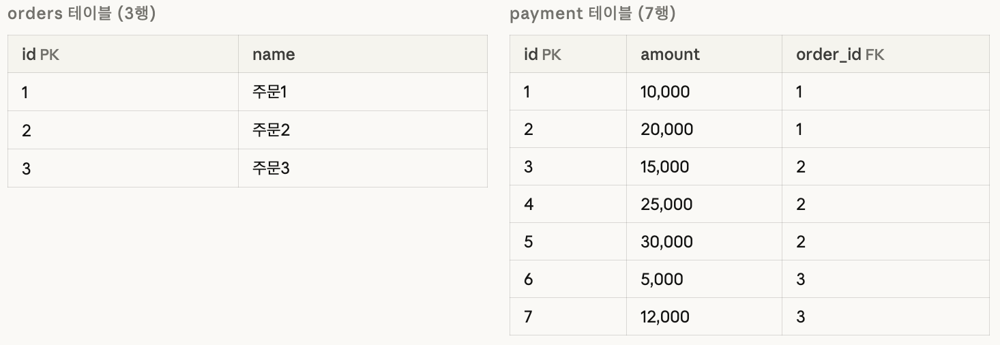

## N + 1 문제
다음과 같이 1:N 관계의 엔티티가 있다고 하자.
```java
@Entity
@Table(name = "orders")
@Getter @NoArgsConstructor
public class Order {
    @Id @GeneratedValue(strategy = GenerationType.IDENTITY)
    @Column(name = "id")
    private Long id;

    @Column(name = "name")
    private String name;

    @OneToMany(mappedBy = "order", fetch = FetchType.LAZY)
    private List<Payment> payments = new ArrayList<>();

    public Order(String name) { this.name = name; }
}

@Entity
@Table(name = "payment")
@Getter @NoArgsConstructor
public class Payment {
    @Id @GeneratedValue(strategy = GenerationType.IDENTITY)
    @Column(name = "id")
    private Long id;

    @Column(name = "amount")
    private int amount;

    @ManyToOne(fetch = FetchType.LAZY)
    @JoinColumn(name = "order_id")  // 컬럼명 소문자로 명시
    private Order order;

    public Payment(Order order, int amount) {
        this.order = order;
        this.amount = amount;
    }
}
```
DB에 데이터는 다음과 같이 저장되어 있다.


그리고 이렇게 호출한다고 하자.
```java
public void findAllWithNPlusOne() {
        List<Order> orders = orderRepository.findAll();
        for (Order order : orders) {
            System.out.println(order.getPayments().size());
        }
    }
```
그럼 로그에서 쿼리를 다음과 같이 확인할 수 있다.
```bash
Hibernate: select o1_0.id,o1_0.name from orders o1_0
Hibernate: select p1_0.order_id,p1_0.id,p1_0.amount from payments p1_0 where p1_0.order_id=?
2
Hibernate: select p1_0.order_id,p1_0.id,p1_0.amount from payments p1_0 where p1_0.order_id=?
1
Hibernate: select p1_0.order_id,p1_0.id,p1_0.amount from payments p1_0 where p1_0.order_id=?
2
```
Lazy Loading 으로 조회 했기 때문에 `select o1_0.id,o1_0.name from orders o1_0` 로 order 를 모두 조회 해 온다.
그리고 `for` 문에서 order 를 하나씩 가져와서 해당 order 에 속한 payment 리스트를 꺼내 사이즈를 확인한다. 그렇게 payment 리스트 크기 만큼 조회 쿼리를 또 실행한다.

만약 Order 가 100개이면, 쿼리가 101번 실행된다.
이것이 `N + 1` 문제다.

`N + 1` 문제를 해결하기 위해서는 3가지 방법이 있다.
1. Fetch Join
2. @BatchSize
3. @EntityGraph

## 1. Fetch Join
```
@Query("SELECT o FROM Order o JOIN FETCH o.payments")
    List<Order> findAllWithFetchJoin();
```
`Join Fetch` 를 하면 JPA가 알아서 쿼리를 한번 실행하여 payment 를 포함한 데이터를 한 번에 조회한다.
```bash
Hibernate: select o1_0.id,o1_0.name,p1_0.order_id,p1_0.id,p1_0.amount from orders o1_0 join payments p1_0 on o1_0.id=p1_0.order_id
```
> join fetch 는 기본적으로 inner join 하기 때문에 left join 을 원한다면 `LEFT JOIN FETCH` 해야한다.

### ⚠️ 주의 사항
#### 1. Cartesian product(카타시안 곱)
먼저, to-one 여러 개인 fetch join 은 문제가 없다.
```java
// Order → Member (ManyToOne)
// Order → Store (ManyToOne)

@Query("SELECT o FROM Order o JOIN FETCH o.member JOIN FETCH o.store")
List<Order> findAll();
```
```bash
SELECT o.*, m.*, s.*
FROM orders o
INNER JOIN member m ON o.member_id = m.id
INNER JOIN store s  ON o.store_id  = s.id
```
Order 3개면 결과도 정확히 3행이다. to-one은 항상 1:1로 매핑되기 때문에 행이 늘어나지 않는다. 얼마든지 한 번에 fetch join해도 안전하다.

또, 단일 컬렉션도 문제 없다.
```java
// Order → payments (OneToMany)

@Query("SELECT o FROM Order o LEFT JOIN FETCH o.payments")
List<Order> findAll();
```
```
// orders(3행) × payments(7행) → 7행 반환
```
하지만, 컬렉션 여러개를 동시에 fetch join 할 때는 문제가 된다.
```java
// Order → payments   (OneToMany)
// Order → coupons    (OneToMany)

@Query("SELECT o FROM Order o LEFT JOIN FETCH o.payments LEFT JOIN FETCH o.coupons")
List<Order> findAll();
```
```sql
SELECT o.*, p.*, c.*
FROM orders o
LEFT JOIN payment p ON o.id = p.order_id
LEFT JOIN coupon  c ON o.id = c.order_id
```
```bash
주문1의 payments: [10,000 / 20,000]        → 2개
주문1의 coupons:  [10% 할인 / 배송비 무료]  → 2개

결과: 2 × 2 = 4행
┌────────┬──────────┬────────────┐
│ order  │ payment  │ coupon     │
├────────┼──────────┼────────────┤
│ 주문1  │ 10,000   │ 10% 할인   │
│ 주문1  │ 10,000   │ 배송비 무료 │  ← payment 중복
│ 주문1  │ 20,000   │ 10% 할인   │  ← coupon 중복
│ 주문1  │ 20,000   │ 배송비 무료 │  ← 둘 다 중복
└────────┴──────────┴────────────┘
```
컬렉션 여러개를 fetch join 하게되면 카테시안 곱(Cartesian product)이 발생한다.
주문1에 payments 100개, coupons 50개 있으면 결과가 5,000행이 된다. Order 전체로 확장하면 DB가 감당 못 할 수준이 될 수 있다.

따라서, 이런 경우에는 쿼리를 나눠서 여러번 실행하는 것이 좋다.
```java
// 1번 쿼리: payments만 fetch join
@Query("SELECT o FROM Order o LEFT JOIN FETCH o.payments")
List<Order> findAllWithPayments();

// 2번 쿼리: coupons만 fetch join
@Query("SELECT o FROM Order o LEFT JOIN FETCH o.coupons")
List<Order> findAllWithCoupons();
```
또는, `@BatchSize` 로 `IN` 쿼리를 쓰는 방법도 있다.

### 2. 페이징 or Limit
페이징 처리나 limit 을 적용 할 때는 fetch join 을 피하는 것이 좋다.
> Fetch joins should usually be avoided in limited or paged queries. This includes:
queries executed using setFirstResult() or setMaxResults(), as in Pagination and limits, or queries with a limit or offset declared in HQL, described below in Limits and offsets.
Nor should they be used with the scroll() and stream() methods described in Scrolling and streaming results.

DB는 행 기준으로 페이징 한다.
페이징은 "몇 번째 행부터 몇 개" 를 DB에게 요청한다. 그런데 fetch join을 하면 Order 3개가 7행으로 뻥튀기된 상태로 DB에 존재한다. DB는 Order 개수가 아니라 행 개수 기준으로 자르기 때문이다.

예를들어, Order 5개, 각각 Payment 2개씩 있는 상황에서 "Order를 페이지당 3개씩 반환해라"를 요청한다고 해보자.
```java
@Query("SELECT o FROM Order o LEFT JOIN FETCH o.payments")
Page<Order> findAll(Pageable pageable);  // size = 3
```
```sql
SELECT o.*, p.*
FROM orders o
LEFT JOIN payment p ON o.id = p.order_id
LIMIT 3  -- DB는 행 기준으로 3개를 자름
```
DB가 보는 테이블
```bash
행1:  주문1 - payment(10,000)   ┐
행2:  주문1 - payment(20,000)   ┘ 주문1의 payment 2개
행3:  주문2 - payment(15,000)   ┐  ← LIMIT 3, 여기서 잘림
행4:  주문2 - payment(25,000)   ┘ 주문2의 payment 중 1개 누락!
행5:  주문3 - payment(5,000)
...
```
결과적으로 주문2의 payment가 1개만 딸려오고, 주문3~5는 아예 조회가 안 된다. 의도한 "Order 3개"가 아니라 "Order 2개 + 데이터 누락"이 된다.

Hibernate 는 이 문제를 알기 때문에 컬렉션 fetch join + 페이징을 같이 쓰면 이런 경고를 남긴다.
```bash
HHH90003004: firstResult/maxResults specified with collection fetch; applying in memory!
```
"DB에서 LIMIT 못 쓰겠으니 전체 다 가져와서 메모리에서 페이징할게" 라는 뜻이다. Order가 100만 개면 100만 개를 전부 메모리에 올리게 된다.

따라서, 페이징이 필요할 때는 `@BatchSize` 를 적용하는 것도 방법이다.

## 2. @BatchSize 
앞서 fetch join 을 피해야 하는 경우가 컬렉션 여러개를 가져올 때와 페이징 처리 할 때가 있었다.
이런 경우는 @BatchSize 를 활용할 수 있다.
```java
@OneToMany
@BatchSize(size = 100)
private List<Payment> payments;

@OneToMany
@BatchSize(size = 100)
private List<Coupon> coupons;
```
```sql
// 1번 쿼리: Order만 페이징해서 가져옴
SELECT o FROM Order o  -- LIMIT 3 정상 동작

// 2번 쿼리: 가져온 Order id로 Payment를 IN 쿼리로 한 번에 조회
SELECT p FROM Payment p WHERE p.order_id IN (1, 2, 3)
```
총 두 번의 쿼리로 페이징도 정확하고, 데이터 누락도 없다.

## 3. @EntityGraph
Entity Graph 도 fetch join 처럼 동작 방식은 동일하게 쿼리에 `JOIN FETCH` sql 이 만들어진다.

### @EntityGraph 적용 방법
### 1. attributePaths 직접 지정
```java
public interface OrderRepository extends JpaRepository<Order, Long> {

    // payments만 fetch
    @EntityGraph(attributePaths = {"payments"})
    List<Order> findAll();

    // payments + member 동시에 fetch (to-one은 여러 개 가능)
    @EntityGraph(attributePaths = {"payments", "member"})
    List<Order> findAllWithMember();

    // 조건 쿼리에도 적용 가능
    @EntityGraph(attributePaths = {"payments"})
    List<Order> findByName(String name);
}
```
### 2. 엔티티에 NamedEntityGraph 적용
```java
@Entity
@NamedEntityGraph(
    name = "Order.withPayments",
    attributeNodes = @NamedAttributeNode("payments")
)
public class Order {
    @Id @GeneratedValue
    private Long id;

    @OneToMany(mappedBy = "order", fetch = FetchType.LAZY)
    private List<Payment> payments;
}
```
Repository에서 name으로 참조
```java
@EntityGraph("Order.withPayments")
List<Order> findAll();
```
### 3. 중첩 연관관계 Fetch
```java
// Order → payments → store 까지 한 번에 fetch
@EntityGraph(attributePaths = {"payments", "payments.store"})
List<Order> findAll();
```

#### ⚠️ 주의사항
entity graph 도 fetch join 과 동일하게 `fetch join` 쿼리를 사용하기 때문에 페이징 처리 시에는 피하는 것이 좋다.