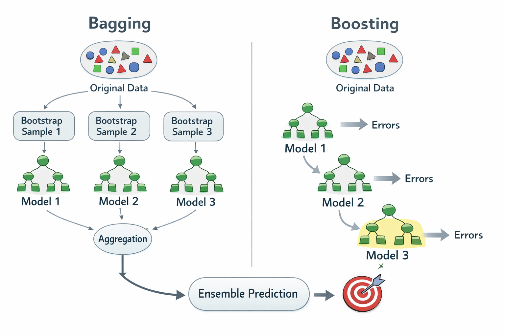

## 트리 기반 모델 특징

- 성능 좋음
- 전처리 시 스케일링 불필요

## 앙상블 방식

**1. Bagging (배깅)**
- 여러 모델을 **독립적으로 학습**
- 평균 또는 투표로 최종 예측
- 분산 감소 효과

**2. Boosting (부스팅)**
- 데이터를 가져와서 첫 번째 모델이 학습
- 첫 번째 모델의 부족함을 다음 모델이 보완

## 모델별 정리

### 🌲 Random Forest (랜덤 포레스트)

> 빠르고 간단하고 성능 무난 — 뭔가 빠르게 해보고 싶을 때 활용

- scikit-learn에서 쉽게 사용 가능

**핵심 하이퍼파라미터**

| 파라미터 | 설명 | 효과 |
|---|---|---|
| `n_estimators` ⭐️ | 트리 개수 | 많을수록 안정적 (속도↓) |
| `max_depth` ⭐️ | 트리 최대 깊이 | 깊으면 과적합 |
| `min_samples_split` | 노드 분할 최소 샘플 수 | 크면 보수적 모델 |
| `min_samples_leaf` | 리프 최소 샘플 수 | 크면 부드러운 모델 |
| `max_features` | 분할 시 사용할 feature 수 | 작으면 다양성↑ → 일반화↑ |

**실무 튜닝 가이드**

- 과적합을 줄이고 싶을 때 → `max_depth` 낮추기 / `min_samples_leaf` 높이기 / `max_features` 낮추기
- 성능이 약할 때 → `n_estimators` 높이기 / `max_depth` 높이기

---

### ⚡ XGBoost (XGB)

> 최고 성능을 목표로 할 때

- 범주형 데이터 One-Hot 인코딩 필요

---

### 🚀 LightGBM

> 빠르고 대용량 데이터에 적합

- 랜덤포레스트보다 낫지만 XGB, CatBoost보다는 떨어짐

---

**XGB / LightGBM 핵심 하이퍼파라미터**

| 파라미터 | 설명 | 효과 |
|---|---|---|
| `n_estimators` ⭐️ | boosting 횟수 | 많을수록 강해짐 |
| `learning_rate` ⭐️ | 학습률 | 작을수록 안정적 |
| `max_depth` ⭐️ | 트리 깊이 | 깊으면 과적합 |
| `subsample` | row 샘플링 비율 | 과적합 방지 |
| `colsample_bytree` | feature 샘플링 비율 | 다양성↑ |
| `reg_lambda` | L2 규제 | 과적합 방지 |
| `reg_alpha` | L1 규제 | sparse 효과 |

**실무 추천값**
```
n_estimators     = 500
learning_rate    = 0.03 ~ 0.1
max_depth        = 4 ~ 8
subsample        = 0.8 ~ 0.9
colsample_bytree = 0.8 ~ 0.9
```

---

### 🐱 CatBoost

> 범주형 컬럼이 많을 때 가장 좋은 선택 — 별도 전처리 없이 바로 사용 가능

- 가장 최근 모델, 성능과 기능 가장 뛰어남
- 기본값만으로도 성능이 괜찮아 하이퍼파라미터 영향을 잘 안 탐

**핵심 하이퍼파라미터**

| 파라미터 | 설명 |
|---|---|
| `iterations` ⭐️ | boosting 횟수 |
| `learning_rate` ⭐️ | 학습률 |
| `depth` ⭐️ | 트리 깊이 |
| `l2_leaf_reg` | L2 규제 |
| `bagging_temperature` | 랜덤성 조절 |

**실무 추천값**
```
iterations    = 1000
learning_rate = 0.03 ~ 0.1
depth         = 4 ~ 8
l2_leaf_reg   = 3 ~ 10
```

---

## 경사하강법

> 데이터가 많을 때 수학적 방식보다 성능이 좋다

기울기의 반대 방향으로 loss를 조정하는 방식

- 기울기 양수 → 음수 방향으로 조정
- 기울기 음수 → 양수 방향으로 조정