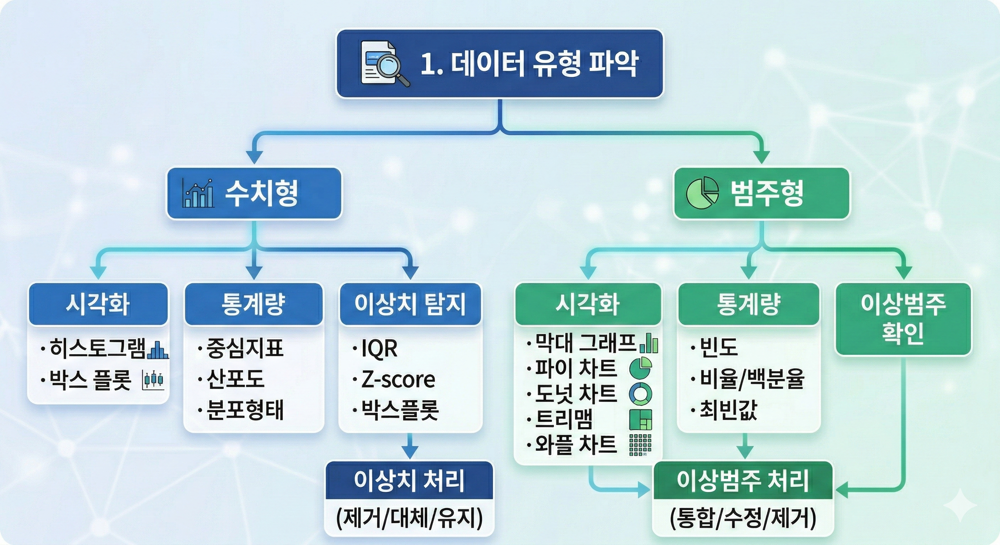

관측을 통해 얻은 데이터에서 그 데이터의 특징을 뽑아내기 위한 기술

- 데이터 자체. 즉, '현실 그 자체'로부터 무엇인가 그 분포의 특징이나 반복되는 것을 이끌어내기 위한 방법이 필요해짐 ➡️ 통계
- 데이터로 나열되어 있는 많은 숫자를 어떤 기준으로 정리 정돈해서 의미있는 정보만을 추출 ➡️ 축약
1. 그래프로 만들어서 그 특징을 파악
2. 숫자하나로 특징을 대표 ➡️ 통계량   

## 통계량
데이터는 수치적으로 널리 퍼져있지만, 그 널리 퍼져있는 것 중에 하나의 수를 모든 데이터를 대표할 수로 뽑은 것

## 데이터 탐색 과정


```markdown
💡 **실전 원칙**
1. 히스토그램을 먼저 그려보기 → 분포 형태, 이상치, 봉우리 개수 확인
2. 평균과 중앙값 비교 → 왜도 확인
3. 첨도 확인 → 봉우리가 두개 이상이면(다봉 분포) → 평균, 중앙값 모두 무의미. 그룹을 나눠서 각각 분석해야 함
```

## 1. 데이터 유형 파악
➡ 내 데이터는 어떤 종류일까?
- 수치형: 숫자로 되어있고, 계산할 수 있는 데이터 (키, 몸무게, 점수)
- 범주형: 그룹/카테고리를 나타내는 데이터 (성별, 혈액형, 학점)

## 수치형 데이터
### 1. 시각화
| 종류 | 용도 | 언제 쓰는가 |
|:---:|:---|:---|
| 히스토그램 + KDE | 분포 형태 파악 | 데이터 탐색 초기, 전체적인 분포 모양 확인할 때 |
| 박스 플롯 | 요약 통계 + 이상치 탐지 | 이상치 확인, 여러 그룹 간 분포 비교할 때 |
| 바이올린 도표 | 분포 형태 + 요약 통계 | 그룹 간 분포 모양까지 비교할 때 |

### 2. 통계량
#### 2.1. 중심지표
➡ 데이터가 어디에 모여있는가?

| 통계량 | 정의 | 이상치 영향 |
|:---:|:---|:---|
| 평균 | 전부 더해서 개수로 나누기 | 많이 흔들림 |
| 중앙값 | 순서대로 나열했을 때 가운데 값 | 덜 흔들림 |
| 최빈값 | 가장 많이 나타나는 값 | 덜 흔들림 |
| 절사평균 | 극단값을 제외하고 평균 | 조금 흔들림 |
| 가중평균 | 각 데이터에 가중치를 부여하여 평균 | 많이 흔들림 |

#### 2.2. 산포도 
➡ 데이터가 얼마나 퍼져있는가?
> 평균은 같지만 데이터가 다를 수 있다!

| 통계량 | 정의 | 이상치 영향 |
|:---:|:---|:---|
| 분산 | 평균과의 차이를 제곱해서 평균 | 많이 흔들림 |
| 표준편차 | 분산의 제곱근 | 많이 흔들림 |
| IQR | 3사분위수 - 1사분위수 (중앙값의 50% 폭) | 강건 |
| CV | (표준편차 / 평균) × 100 | 많이 흔들림 |
| 범위 | 최대값 - 최소값 | 많이 흔들림 |

```
💡 CV(변동계수)
➡ 단위나 스케일이 다를 때, 두 가지 상황을 비교하기 어렵기 때문에 표준편차를 평균으로 나누어 무단위(%)로 변환하여 비교

예) 
- 키: 평균 170, 표준편차 10
- 몸무게: 평균 70, 표준편차 10

CV(키) = (10 / 170) * 100 = 5.88%
CV(몸무게) = (10 / 70) * 100 = 14.29%

➡ 몸무게가 키보다 변동성이 크다.
```

#### 2.3. 분포형태
➡ 데이터가 어떤 모양으로 퍼져있는가?
| 통계량 | 정의 | 이상치 영향 |
|:---:|:---|:---|
| Skewness (왜도) | 데이터 분포의 쏠림 정도 | 많이 흔들림 |
| Kurtosis (첨도) | 데이터 분포의 뾰족한 정도 | 많이 흔들림 |

#### 왜도(Skewness)
데이터 분포의 쏠림 정도  

**음의왜도**
- 왼쪽 꼬리가 긴 형태의 분포

**양의왜도**
- 오른쪽 꼬리가 긴 형태의 분포

```markdown
💡**헷갈렸던 부분**
자꾸 꼬리 쪽이 다수라고 생각함❌

- 꼬리 = 소수
- 몰린 곳 = 다수

예) 왼쪽 꼬리가 길다 = 왼쪽(저득점) 소수, 오른쪽(고득점) 다수
```

| 음의 왜도 (< 0) | 정규분포 (= 0) | 양의 왜도 (> 0) |
|:---:|:---:|:---:|
| 왼쪽으로 꼬리 | 대칭 | 오른쪽으로 꼬리 |
| 꼬리 ← [중심] | [중심] | [중심] → 꼬리 |
| 평균 < 중앙값 < 최빈값 | 평균 = 중앙값 = 최빈값 | 최빈값 < 중앙값 < 평균 |

#### 첨도(Kurtosis)
꼬리 두께. 극단치가 많을수록 뾰족해진다.
평범하지 않은 일이 일어 날 가능성 측정 지표

| 낮은 첨도 (< 0) | 정규분포 (= 0) | 높은 첨도 (> 0) |
|:---:|:---:|:---:|
| 납작한 분포 | 보통 분포 | 뾰족한 분포 |
| 얇은 꼬리 | 보통 꼬리 | 두꺼운 꼬리 |
| 극단값 적음 | 기준 | 극단값 많음 |

```markdown
⚠️ **평균의 함정**   
➡ 이상치가 있으면 평균이 왜곡될 수 있다.  

- 이상치에 취약하다
- 분포의 형태를 파악하기 어렵다 → 히스토그램을 그려봐야 함
- 두 봉우리(bimodal)일 때 평균이 의미없음 → 그룹을 나눠서 각각 분석
```
### 3. 이상치 탐지
| 방법 | 사용하는 통계량  | 특징 |
|:---:|:---|:---|
| IQR 방법 | Q1 - 1.5 * IQR ~ Q3 + 1.5 * IQR | 중앙값 기반, 비대칭 분포에 강건 |
| Z-score 방법 | 평균에서 표준편차의 몇 배 이상 떨어진 값 (Z = (값 - 평균) / 표준편차) | 정규분포 가정, 이상치에 민감 |
| 박스 플롯 | Q1, Q2, Q3, IQR | 시각적 확인 가능 |

---

## 범주형 데이터
### 1. 시각화
| 종류 | 용도 | 언제 쓰는가 |
|:---:|:---|:---|
| 막대 그래프 | 범주별 빈도/비율 비교 | 범주 간 크기 비교, 가장 기본적인 시각화 |
| 파이 차트 | 전체 대비 비율 표현 | 범주가 적고(5개 이하), 전체 대비 비중 강조할 때 |
| 도넛 차트 | 전체 대비 비율 + 중앙 정보 | 파이 차트와 유사, 중앙에 총합/제목 표시할 때 |
| 트리맵 | 계층적 비율 표현 | 범주가 많거나 계층 구조가 있을 때 |
| 와플 차트 | 비율의 직관적 표현 | 백분율을 시각적으로 명확히 보여줄 때 |
| 누적 막대 그래프 | 그룹별 구성 비율 | 여러 그룹의 범주 구성을 비교할 때 |


### 2. 통계량
| 통계량 | 설명 |
|:---|:---|
| 빈도 (Frequency) | 각 범주의 개수 |
| 비율 (Proportion) | 각 범주의 비율 (0~1) |
| 백분율 (Percentage) | 비율 × 100 |
| 최빈값 (Mode) | 가장 많이 나타나는 범주 |
| 누적 빈도/비율 | 순서형 범주에서 사용 |

**예시) 혈액형 데이터 (A, B, O, AB)**

| 혈액형 | 빈도 | 비율 | 백분율 |
|:---:|:---:|:---:|:---:|
| A | 40 | 0.4 | 40% |
| B | 25 | 0.25 | 25% |
| O | 30 | 0.3 | 30% |
| AB | 5 | 0.05 | 5% |

→ 최빈값: A형  
→ 평균, 중앙값은 의미 없음 (숫자가 아니므로)