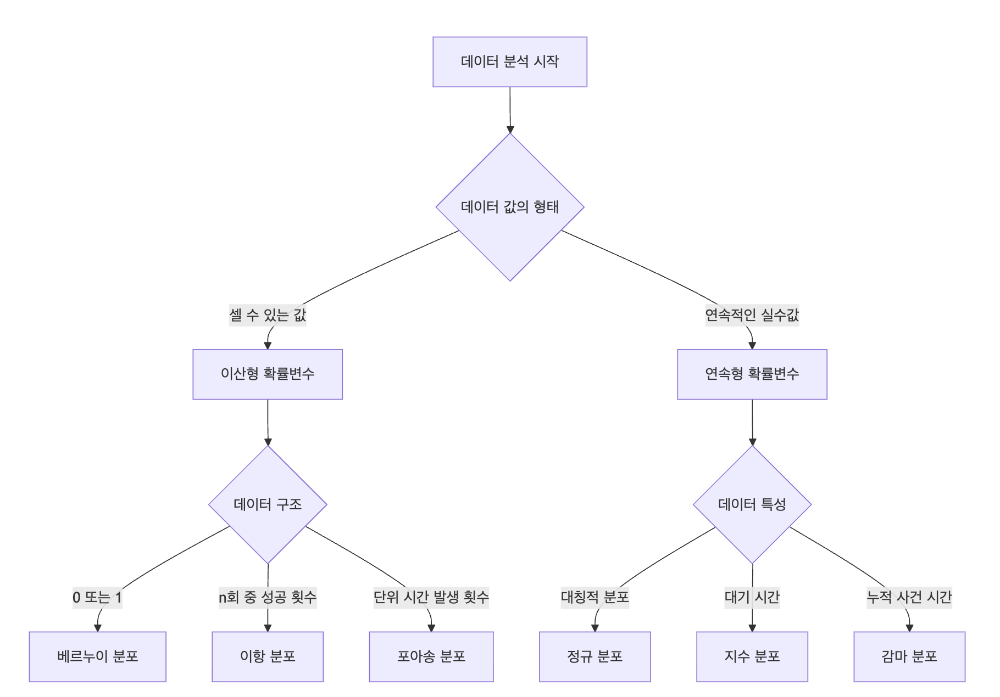
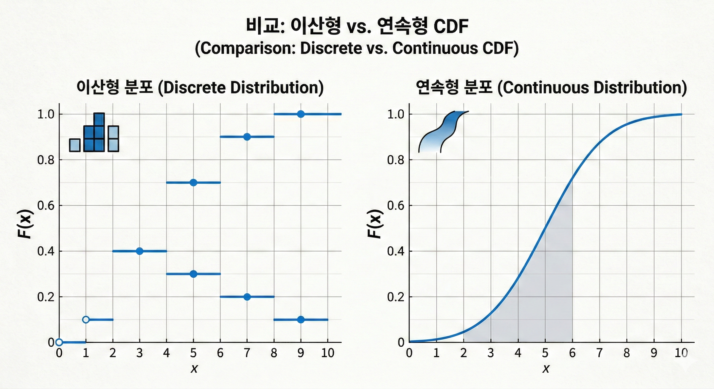

## 1. 확률 vs 통계

| 구분 | 확률 | 통계 |
|------|------|------|
| 방향 | 모집단 → 표본 (연역적) | 표본 → 모집단 (귀납적) |
| 아는 것 | 분포, 확률 | 표본 데이터 |
| 구하는 것 | "이런 표본이 나올 확률은?" | "모집단은 어떨까?" |

> 확률 = 알고 있는 규칙으로 미래 예측 / 통계 = 데이터로 모르는 규칙 추론

## 확률변수 유형

| 구분 | 이산형 확률변수 | 연속형 확률변수 |
|------|----------------|----------------|
| 값의 형태 | 셀 수 있는 값 (0,1,2,…) | 연속적인 실수값 |
| 함수 | 확률질량함수 (PMF) | 확률밀도함수 (PDF) |
| 특정 값의 확률 | 존재 | 0 |
| 대표 예시 | 동전 앞면 개수, 고객 수 | 키, 몸무게, 시간 |

---

### 이산형 확률분포

| 분포 | 정의 | 모수 | 기댓값 | 분산 | 사용 상황 |
|------|------|------|--------|------|------------|
| 베르누이 | 1회 시행 성공/실패 | p | p | p(1-p) | 합격/불합격 |
| 이항 | n번 시행 중 성공 횟수 | n, p | np | np(1-p) | 반복 실험 성공 횟수 |
| 포아송 | 단위 시간당 사건 발생 횟수 | λ | λ | λ | 시간당 방문자 수 |

---

### 연속형 확률분포

| 분포 | 정의 | 모수 | 기댓값 | 분산 | 사용 상황 |
|------|------|------|--------|------|------------|
| 균등 | 구간 내 동일 확률밀도 | a, b | (a+b)/2 | (b-a)^2/12 | 완전 무작위 |
| 정규 | 평균 중심 대칭 분포 | μ, σ^2 | μ | σ^2 | 자연현상, 오차 |
| 지수 | 사건 발생까지 시간 | λ | 1/λ | 1/λ^2 | 대기 시간 |

---

### 데이터 유형별 분포 선택 가이드

| 데이터 형태 | 추천 분포 |
|-------------|------------|
| 성공/실패 | 베르누이 |
| 고정 시행 내 성공 횟수 | 이항 |
| 단위 시간 발생 횟수 | 포아송 |
| 사건 대기 시간 | 지수 |
| 자연적 오차 | 정규 |

---

## 확률의 기본 법칙

| 법칙 | 수식 | 설명 |
|------|------|------|
| 여사건 | $P(A^c) = 1 - P(A)$ | A가 안 일어날 확률 |
| 덧셈 법칙 | $P(A \cup B) = P(A) + P(B) - P(A \cap B)$ | 겹치는 부분을 한 번 빼줌 |
| 곱셈 법칙 | $P(A \cap B) = P(A) \cdot P(B\mid A)$ | 둘 다 일어날 확률 |
| 조건부 확률 | $P(A\mid B) = \frac{P(A \cap B)}{P(B)}$ | B가 일어난 상황에서 A의 확률 |
---

### 독립 vs 배반

| 구분 | 의미 | 수식 |
|------|------|------|
| 독립 | 한 사건이 다른 사건 확률에 영향 없음 | $P(A \cap B) = P(A) \cdot P(B)$ |
| 배반 | 두 사건이 동시에 일어날 수 없음 | $P(A \cap B) = 0$ |

> **주의**: 확률이 0이 아닌 배반 사건은 독립이 될 수 없다.

---

### 기대값과 분산

| 구분 | 수식 | 의미 |
|------|------|------|
| 기대값 | $E[X] = \sum x \cdot P(X=x)$ | 확률을 가중치로 한 가중평균 |
| 분산 | $Var(X) = E[X^2] - (E[X])^2$ | 평균에서 얼마나 퍼져 있는가 |
| 표준편차 | $\sigma = \sqrt{Var(X)}$ | 분산의 제곱근 |

---

### 확률분포 함수 비교

| 함수 | 이산형 (PMF) | 연속형 (PDF) |
|------|-------------|-------------|
| 의미 | 각 값의 확률 | 확률 밀도 (면적이 확률) |
| 특정 값 확률 | $P(X=x)$ 직접 사용 | 특정 값의 확률 = 0 (면적으로 계산) |
| 합 | $\sum P(X=x) = 1$ | $\int f(x)dx = 1$ |

```text
💡PDF

그래프 아래 면적 = 확률

예를 들어 정규분포:
	•	가운데가 가장 높고
	•	양쪽으로 갈수록 낮아짐
	•	전체 면적 = 1

확률은 “넓이”.
```

### 누적분포함수 (CDF)

$F(x) = P(X \leq x)$

| 계산 목적 | 공식 | scipy |
|----------|------|-------|
| $P(X \leq x)$ | $F(x)$ | `dist.cdf(x)` |
| $P(X > x)$ | $1 - F(x)$ | `dist.sf(x)` |
| $P(a < X \leq b)$ | $F(b) - F(a)$ | `dist.cdf(b) - dist.cdf(a)` |
| $P(X \geq k)$ (이산) | $1 - F(k-1)$ | `dist.sf(k-1)` |




```markdown
💡 **왜 누적해야하지?**
➡ 보통 우리가 알고 싶은 것들은 "특정 값"이 아니라 "특정 값 이하" 또는 "특정 값 이상"이기 때문.

예) 
- 시험 점수가 70점 이상일 확률
- 키가 170cm 이상일 확률
- 1시간 안에 10명 이상 방문할 확률

그래서 우리는 이렇게 묻는다:
"169~171 사이일 확률은?"

즉, 구간 확률을 구한다.

구간 확률은 결국:
왼쪽부터 쌓아서 계산.

그게 '누적분포함수(CDF)''
```
---

## 8. 정규분포 심화

### 68-95-99.7 법칙

| 구간 | 확률 |
|------|------|
| $\mu \pm 1\sigma$ | 약 68% |
| $\mu \pm 2\sigma$ | 약 95% |
| $\mu \pm 3\sigma$ | 약 99.7% |

### Z-score (표준화)

$$Z = \frac{X - \mu}{\sigma}$$

"평균에서 표준편차 몇 개 떨어져 있는지"를 나타내는 값

| Z-score | 의미 |
|---------|------|
| Z = 0 | 평균과 같음 |
| Z = 1 | 평균보다 1σ 높음 (상위 약 16%) |
| Z = 2 | 평균보다 2σ 높음 (상위 약 2.5%) |
| Z = -1 | 평균보다 1σ 낮음 (하위 약 16%) |

---

## 9. 분포 간 관계

- **이항 → 포아송 근사**: n 크고 p 작을 때 (np = λ)
- **이항 → 정규 근사**: n 충분히 클 때 (np ≥ 5, n(1-p) ≥ 5)
- **포아송 → 정규 근사**: λ ≥ 10일 때

### 중심극한정리 (CLT)

> 모집단이 어떤 분포이든, 표본 크기가 충분히 크면 **표본평균의 분포는 정규분포에 가까워진다.**

$$\bar{X} \sim N\left(\mu, \frac{\sigma^2}{n}\right)$$

---

## 10. scipy.stats 핵심 메서드 정리

| 메서드 | 설명 |
|--------|------|
| `.pmf(k)` | 이산형: P(X=k) |
| `.pdf(x)` | 연속형: 확률밀도 f(x) |
| `.cdf(x)` | 누적확률 P(X≤x) |
| `.sf(x)` | 생존함수 P(X>x) = 1-cdf(x) |
| `.ppf(q)` | cdf 역함수 (확률 → 값) |
| `.isf(q)` | sf 역함수 (우측확률 → 값) |
| `.rvs(size)` | 난수 생성 |

### 분포 생성 예시

```python
from scipy import stats

# 이산형
stats.bernoulli(p=0.3)
stats.binom(n=10, p=0.3)
stats.poisson(mu=5)

# 연속형
stats.uniform(loc=0, scale=10)   # U(0, 10)
stats.expon(scale=100)            # 평균 대기시간 100 (scale = 1/λ)
stats.norm(loc=170, scale=6)      # N(170, 6²)
