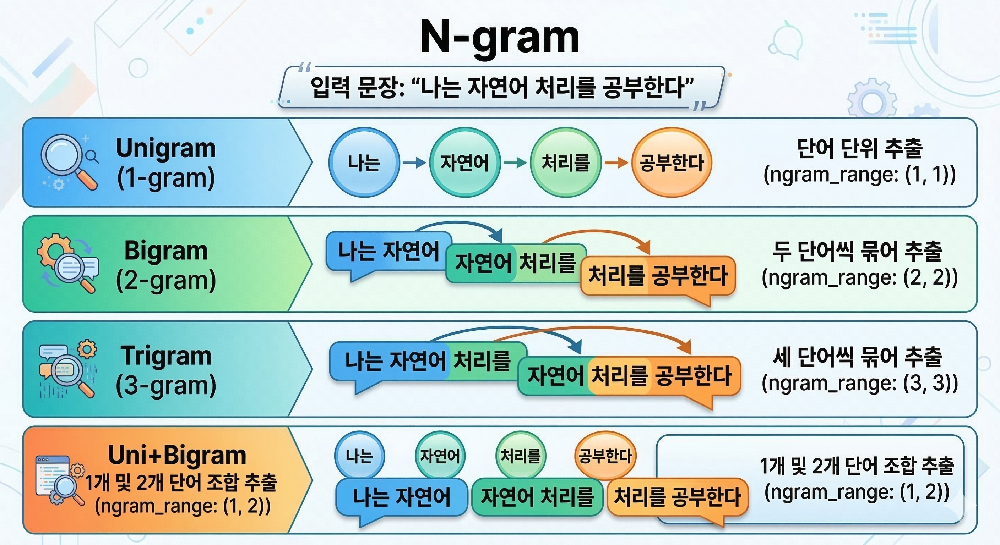

## 1. 텍스트 전처리 파이프라인

텍스트 데이터의 원본은 노이즈가 많기 때문에 전처리 파이프라인을 거쳐 텍스트를 깔끔하게 정리한다.

1. 정제(Cleaning)
2. 정규화(Nomalization) - 같은 의미의 텍스트를 통일 시킴
3. 형태소 분석(Tokeniztion)
4. 불용어 제거(Stopword Removal)

### 1-1. 정제(Cleaning)
분석에 불필요한 기호 제거
| 제거 대상 | 예시 | 이유 |
|-----------|------|------|
|**HTML 태그**| `<b>`, `<br>`, `<div>` | 웹 크롤링 시 함께 수집됨 |
|**URL**| `http://link.com` | 분석에 무의미한 링크 |
|**특수문자/이모지**| `!!!`, `@user`, `#태그`, `~` | 텍스트 의미 분석에 불필요 |
|**숫자**| `10점`, `2024년` | 도메인에 따라 제거 여부 결정 |
|**여러 공백**| `"영화  정말   좋다"` | 하나의 공백으로 정리 |

### 1-2. 정규화(Nomalization)
같은 의미의 텍스트를 통일 시킴
- ㅋㅋㅋ -> ㅋ
- ㅠㅠㅠㅠ -> ㅠ

### 1-3. 형태소(Tokeniztion) 분석 - 토큰화
문장을 의미있는 최소 단위인 `형태소`로 분리
```
💡토큰화
텍스트를 의미있는 최소 단위로 분리
```
- "I love this band" → ["I", "love", "this", "band"]
- "나는 이 밴드를 좋아한다" → ["나", "는", "이", "밴드", "를", "좋아한다"]

```
💡kiwipiepy
- 한국어 형태소 분석기로, C++로 작성되어 빠른 속도와 높은 정확도를 제공
- 다른 패키지에 의존성이 없으므로 pip만으로 설치가 완료 (Java 불필요)
- 공식 문서: https://bab2min.github.io/kiwipiepy/
```

| | 형태소 | 품사태그 | 의미 |
|---|---|---|---|
| 0 | 이 | IC | 감탄사 |
| 1 | 자세 | NNG | 일반명사 |
| 2 | 교정 | NNG | 일반명사 |
| 3 | 밴드 | NNG | 일반명사 |
| 4 | 는 | JX | 보조사 |
| 5 | 정말 | MAG | 부사 |
| 6 | 효과 | NNG | 일반명사 |
| 7 | 가 | JKS | 주격조사 |
| 8 | 좋 | VA | 형용사 |
| 9 | 습니다 | EF | 종결어미 |

### 1-4. 불용어 제거(Stopword Removal)
`불용어` 는 자연어 처리(NLP)에서 분석에 큰 의미가 없으면서 자주 등장하는 단어(예: the, is, at, which, on, 정말, 진짜, 너무 등)를 의미한다.

1. 도메인 불용어 선택
2. 범용 + 도메인 불용어 합치기 (중복 제거)
3. 불용어 제거를 전체 데이터에 적용

**한국어 불용어 리스트 참고 자료:**

| 출처 | 설명 | 링크 |
|------|------|------|
| **stopwords-ko** | 약 680개의 범용 한국어 불용어 리스트 (가장 널리 사용) | https://github.com/stopwords-iso/stopwords-ko |
| **spaCy Korean** | spaCy 한국어 모델에 포함된 불용어 | https://github.com/explosion/spaCy |

## 2. CountVectorizer와 N-gram 빈도 분석



`CountVectorizer`는 전처리된 텍스트 데이터를 숫자행렬(빈도행렬)로 변환하는 도구로, 각 문서에서 단어의 빈도를 계산하여 행렬로 만들어준다.
0이 많은 건 `희소행렬`로 저장해서 메모리를 아낀다.

N-gram은 `CountVectorizer`의 `ngram_range` 파라미터로 연속된 N개의 단어 조합을 추출한다.

예시 문장: `"나는 자연어 처리를 공부한다"`

| N-gram 종류 | ngram_range | 추출 결과 |
|---|---|---|
| Unigram (1-gram) | (1, 1) | 나는, 자연어, 처리를, 공부한다 |
| Bigram (2-gram) | (2, 2) | 나는 자연어, 자연어 처리를, 처리를 공부한다 |
| Trigram (3-gram) | (3, 3) | 나는 자연어 처리를, 자연어 처리를 공부한다 |
| Uni+Bigram | (1, 2) | 나는, 자연어, 처리를, 공부한다, 나는 자연어, 자연어 처리를, 처리를 공부한다 |

일반적으로 `uni/bigram` 이 더 많은 의미를 담고 있어 많이 쓰인다.

## 3. TF-IDF 벡터화 및 핵심 키워드 추출

- 이 단어가 이 문서에서 얼마나 중요한가를 반영
- TF(Term Frequency): 하나의 문서 내 단어 빈도수
- IDF(Inverse Document Frequency): 전체 문서 중 해당 단어가 등장하는 문서의 비율의 역수 (전체 문서 수 / 단어 등장 문서 수)
- Counter Verterizer 를 개선 한 것이 Tfidf Vectorizer이다.

>전체 문서에서 등장하는 단어 빈도수는 많지만(TF) 그 단어가 등장하는 문서가 적은 정도 (IDF, 적을 수록 값이 커진다!)
---
#### 💡희소행렬
>TF-IDF 행렬은 희소행렬로 저장된다.

행렬의 대부분의 값은 0일 것이다.
성적표를 예시로 들어보면,
| 학생 | 수학 | 영어 | 과학 | 음악 | 미술 | 체육 | ... 100과목 |
|---|---|---|---|---|---|---|---|
| 철수 | 90 | 0 | 0 | 0 | 0 | 0 | ... |
| 영희 | 0 | 85 | 0 | 0 | 0 | 0 | ... |
| 민수 | 0 | 0 | 75 | 0 | 0 | 0 | ... |

이렇게 만들어진 행렬을 희소행렬 방식으로 저장하면
```
(철수, 수학) = 90
(영희, 영어) = 85
(민수, 과학) = 75
```
이렇게 저장한다.

- **컬럼 목록** = 전체 단어 사전 (메모리에 한 번만 저장)  
- **셀 값** = 각 문서에서 해당 단어의 등장 여부 (0이면 저장 안 함)  

철수가 음악 점수가 0이라고 해서 "음악" 과목이 사라지는 게 아니라, 그냥 "철수-음악" 조합은 기록하지 않는 것이다.

**쉽게 말하면:** 출석부에 결석한 사람만 표시하는 것과 같다. 반 학생 명단은 그대로 있지만, 결석 기록에는 결석한 사람만 적는 것처럼.

그래서 메모리를 절약할 수 있다.

### 3-1. 문서 빈도(DF) 기반 필터링: min_df, max_df
- min_df: 최소 문서 빈도
- max_df: 최대 문서 빈도

| 파라미터 | 의미 | 효과 | 예시 |
|----------|------|------|------|
| `max_df=0.85` | 전체 문서의 **85% 이상** 의 문서에 등장하는 단어 제거 | 사실상 **자동 불용어 제거** | "어깨", "자세" 등 거의 모든 리뷰에 나오는 단어 |
| `min_df=3` | **3개 미만의 문서** 에 등장하는 단어 제거 | **희귀 단어(노이즈) 제거** | 오타, 고유명사, 1회성 표현 |

> min_df, max_df 모두 단어의 출현 횟수가 아니라, 해당 단어가 포함된 문서의 수를 기준으로 한다.

> 수동 불용어 리스트가 없어도 max_df 한 줄이면 고빈도 공통 단어를 자동으로 걸러낼 수 있다. 실무에서는 수동 불용어 + DF기반 필터링을 함께 사용한다.

### 3-2. 감성 분석을 위한 고유 키워드 추출
TF-IDF 결과에서 몇몇 단어가 긍정/부정 양쪽에 모두 해당하는 공통 키워드는 감성을 구분하는 데 도움이 되지 않는다.

각 그룹만의 고유 키워드를 찾기 위해, 긍정/부정 그룹 간의 TF-IDF 차이를 계산한다.

- diff = (긍정 평균 TF-IDF - 부정 평균 TF-IDF)
- diff > 0 : 긍정 문서에서 더 자주 등장하는 단어
- diff < 0 : 부정 문서에서 더 자주 등장하는 단어

### 3-3. 동시출현(Co-occurrence) 분석
지금까지 사용한 N-gram은 바로 옆에 붙어있는 단어들의 조합만 고려했다. 하지만 실제로는 단어들이 떨어져 있어도 함께 등장하는 경우가 많다.

예를 들어, "이 자세 교정 밴드는 정말 효과가 좋다" 라는 문장에서,
- "자세"와 "좋다"는 3칸 떨어져 있지만, 함께 등장하면 긍정적인 의미를 가진다.
- "자세"와 "나쁘다"는 3칸 떨어져 있지만, 함께 등장하면 부정적인 의미를 가진다.

이런 경우를 고려하기 위해 동시출현 빈도를 분석한다.

#### 동시출현 행렬 만드는 법
- CountVectorizer(binary=True)로 DTM (Document Term Matrix)을 만든다. (등장 여부만 1, 0으로 표시) -> 두 단어가 같은 문서에 등장하면 1, 아니면 0
- DTM.T @ DTM : 동시출현 행렬 생성
- DTM.T의 행과 DTM의 열을 곱하면 동시출현 행렬이 된다.
- 두 단어가 모두 등장한 리뷰에서만 1x1=1이 된다.


